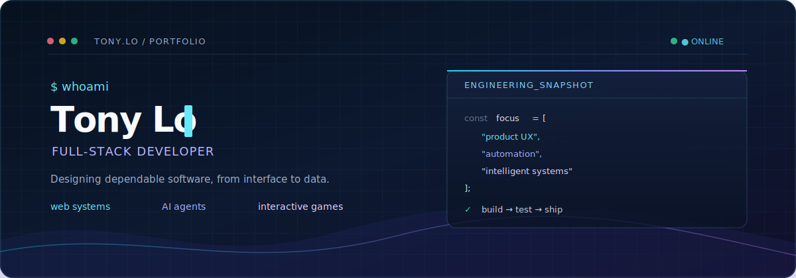

## 👋 About

I'm **Tony Lo**, a Computer Science graduate from **Auburn University**. I build polished, end-to-end software: responsive interfaces, dependable data-backed services, test automation, and interactive AI-driven experiences.

- 🎓 **B.S. Computer Science** — Auburn University (Class of 2026)
- 🌐 **Product engineering** — React, Node.js, Firebase, PHP, MySQL
- 🤖 **Applied AI** — intelligent game agents and graph-based ML classifiers
- 🎮 **Interactive development** — Unity3D and HTML5 Canvas
- 🌍 **Trilingual** — English · Mandarin · Cantonese

 

## 🛠️ Tech Stack

**Languages**

**Frameworks & Libraries**

**Tools & Platforms**

 

## 🚀 Featured Projects

<table>
<tr>
<td width="50%">

### 🐟 [Fish Life Adventure](https://github.com/tonytheg/fish-life-adventure)
**HTML5 Canvas · JavaScript**

A pixel-art ocean survival game built entirely in vanilla JavaScript. Eat smaller fish to grow, avoid predators, and evolve through multiple life stages.

🎮 [**Play it live →**](https://tonytheg.github.io/fish-life-adventure/)

</td>
<td width="50%">

### 🔍 [HN Sort Validator](https://github.com/tonytheg/hn-sort-validator)
**Playwright · Node.js · Automated Testing**

A QA automation tool that scrapes Hacker News, validates article sorting order, and generates comprehensive HTML test reports.

</td>
</tr>
<tr>
<td width="50%">

### 📊 [k-NN Graph Classifier](https://github.com/tonytheg/knn-graph-classifier)
**Python · NetworkX · NumPy · Matplotlib**

Machine learning project implementing k-NN classification on real-world collaboration network graphs with custom feature extraction.

</td>
<td width="50%">

### 📚 [Bookstore Database](https://github.com/tonytheg/bookstore-database)
**MySQL · PHP · HTML**

Full-stack relational database system for an online bookstore with 19 complex SQL queries, web interface, and ER schema design.

</td>
</tr>
<tr>
<td width="50%" colspan="2" align="center">

### 🤖 [Pacman AI Agents](https://github.com/tonytheg/pacman-ai-agents)
**Python · Minimax · Alpha-Beta Pruning · Expectimax**

Intelligent game-playing agents for Pacman using adversarial search algorithms — Minimax, Alpha-Beta Pruning, and Expectimax.

</td>
</tr>
</table>

 

## 📈 GitHub Stats

 

## 🤝 Let's Connect

 

Open to software engineering opportunities · Let’s build something useful.

